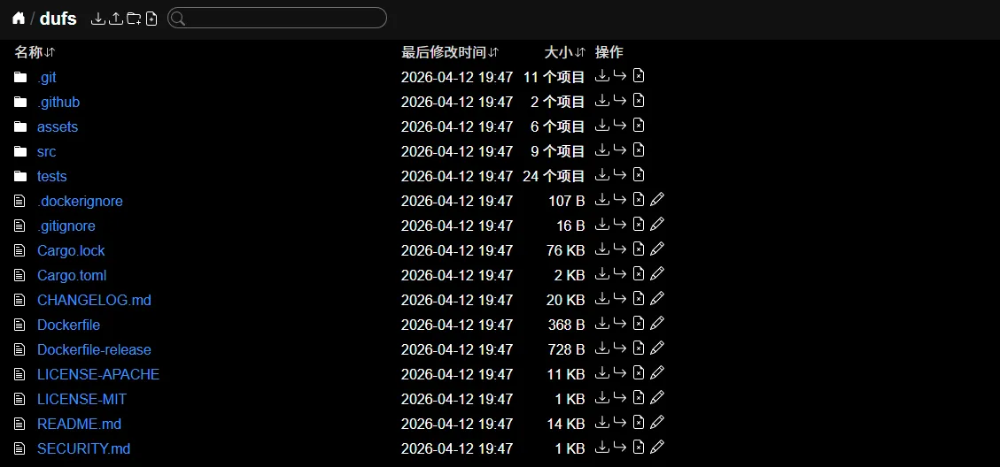

# Dufs 文件服务器（中文界面版）

[](https://github.com/sigoden/dufs/actions/workflows/ci.yaml)
[](https://crates.io/crates/dufs)
[](https://hub.docker.com/r/mobufan/dufs-zh)
[](https://hub.docker.com/r/mobufan/dufs-zh)

Dufs 是一款**独具特色的实用文件服务器**，支持静态文件服务、上传、搜索、权限控制、WebDAV，并内置**中文界面**。



## 功能特性

- 🖥️ **现代化 Web 界面** — 毛玻璃顶栏，平滑动画、文件类型标签，明暗主题自动切换
- 📁 **静态文件服务** — 支持任意目录或单个文件
- ⬆️ **文件上传** — 拖拽上传、断点续传（20MB+）、文件夹上传
- 📦 **ZIP 下载** — 一键将文件夹打包下载
- ✏️ **在线编辑** — 浏览器内直接创建、编辑文本文件
- 🔍 **即时搜索** — 文件名模糊搜索
- 🔐 **权限控制** — 用户名密码认证，支持读写/只读角色
- 🌐 **WebDAV** — 挂载为网络驱动器（Windows / macOS / Linux）
- 🔒 **HTTPS** — 内置 TLS/SSL 支持
- 🌈 **CORS 跨域** — 轻松对接前端应用
- 🎨 **自定义界面** — 替换 assets 目录实现完全定制

---

## 快速上手

### 使用 Docker（推荐）

```sh
# 拉取镜像
docker pull mobufan/dufs-zh:latest

# 运行（将当前目录映射到容器）
docker run -v $(pwd):/data -p 5000:5000 --rm mobufan/dufs-zh:latest /data
```

> Windows PowerShell：
> ```powershell
> docker run -v ${pwd}:/data -p 5000:5000 --rm mobufan/dufs-zh:latest /data
> ```

### 下载二进制

从 [GitHub Releases](https://github.com/sigoden/dufs/releases) 下载对应平台版本，解压后将 `dufs` 加入系统 PATH。

### 编译安装

```sh
# macOS / Linux — Homebrew
brew install dufs

# Rust — Cargo
cargo install dufs

# 从源码构建
git clone https://github.com/sigoden/dufs.git
cd dufs
cargo build --release
./target/release/dufs
```

然后浏览器打开 **http://localhost:5000**

---

## 部署教程

### Docker 部署

> ✅ **支持多架构**：amd64（Intel/AMD）、arm64（Apple Silicon / ARM 服务器）

#### 方式一：直接使用现成镜像

```sh
# 拉取镜像
docker pull mobufan/dufs-zh:latest

# 基础运行（只读浏览）
docker run -d \
  --name dufs \
  -v /your/data/path:/data \
  -p 5000:5000 \
  --restart always \
  mobufan/dufs-zh:latest /data

# 开启全部操作权限（上传/删除/新建/编辑）
docker run -d \
  --name dufs \
  -v /your/data/path:/data \
  -p 5000:5000 \
  --restart always \
  mobufan/dufs-zh:latest /data -A
```

#### 方式二：使用 Docker Compose

创建 `docker-compose.yml`：

```yaml
services:
  dufs:
    image: mobufan/dufs-zh:latest
    container_name: dufs
    restart: always
    ports:
      - 5000:5000
    volumes:
      - /mnt:/data
    command: /data -A  # 添加 -A 开启全部权限
```

启动服务：

```sh
docker-compose up -d
```

### 常见部署场景

**指定子目录并开放写入**

```sh
docker run -d \
  --name dufs \
  -v /mnt/shared:/mnt/shared \
  -p 5000:5000 \
  --restart always \
  mobufan/dufs-zh:latest /mnt/shared/media -A
```

**加用户名密码保护**

```sh
docker run -d \
  --name dufs \
  -v $(pwd):/data \
  -p 5000:5000 \
  --restart always \
  mobufan/dufs-zh:latest /data \
  -a admin:你的密码@/:rw
```

**HTTPS — 配合 TLS 证书**

```sh
docker run -d \
  --name dufs \
  -v $(pwd):/data \
  -v /path/to/certs:/certs \
  -p 443:443 \
  --restart always \
  mobufan/dufs-zh:latest /data \
  --tls-cert /certs/server.crt --tls-key /certs/server.key
```

**指定 IP / 自定义端口**

```sh
docker run -d \
  --name dufs \
  -v $(pwd):/data \
  -p 192.168.1.100:8080:8080 \
  --restart always \
  mobufan/dufs-zh:latest /data -p 8080
```

### 管理命令

```sh
# 查看运行状态
docker ps | grep dufs

# 查看日志
docker logs -f dufs

# 停止服务
docker stop dufs

# 启动服务
docker start dufs

# 重启服务
docker restart dufs

# 删除容器
docker stop dufs && docker rm dufs
```

---

#### 🛠️ 本地构建镜像

如果想基于本地源码构建镜像：

**第一步：克隆项目**

```bash
git clone https://github.com/meimolihan/dufs-zh.git
cd dufs-zh
```

**第二步：开启 Docker 多架构支持**

> 构建支持 amd64 / arm64 双架构的镜像。`docker buildx create` 只需执行一次，之后每次构建直接使用即可。

```bash
# 启用 experimental 模式（Docker 旧版本需要，新版本可省略）
export DOCKER_CLI_EXPERIMENTAL=enabled

# 创建新的 buildx builder
docker buildx create --name mybuilder --use

# 启动并检查 builder
docker buildx inspect mybuilder --bootstrap
```

**第三步：构建并推送多架构镜像**

> 需要先执行 `docker login` 登录 Docker Hub。

```bash
# 先登录 Docker Hub
docker login -u mobufan

# 构建 amd64 + arm64 双架构镜像
docker buildx build \
 --platform linux/amd64,linux/arm64 \
 -t mobufan/dufs-zh:latest \
 --load \
 .

# amd64 + arm64 双架构镜像，推送到 Docker Hub
docker push mobufan/dufs-zh
```

| 参数 | 说明 |
|------|------|
| `--platform` | 指定目标架构，支持 `linux/amd64`、`linux/arm64`、`linux/arm/v7` |
| `--push` | 构建完成后自动推送到镜像仓库 |
| `-t` | 镜像标签，可同时指定多个（:latest + 版本号） |

> 💡 如果只想本地构建不推送，去掉 `--push`，改为加 `-o type=docker`：
> ```bash
> docker buildx build --platform linux/amd64,linux/arm64 -t mobufan/dufs-zh:latest -o type=docker .
> ```

**单独构建某一架构**

- 构建单架构 `amd64` 到本地并推送

```bash
# 先登录 Docker Hub
docker login -u mobufan

# 构建单架构 amd64 到本地
docker buildx build \
 --platform linux/amd64 \
 -t mobufan/dufs-zh:amd64 \
 -t mobufan/dufs-zh:1.0.0-amd64 \
 --load \
 .

# amd64 架构镜像，推送到 Docker Hub
docker push mobufan/dufs-zh:amd64
docker push mobufan/dufs-zh:1.0.0-amd64
```

- 构建单架构 `arm64` 到本地并推送

```bash
# 先登录 Docker Hub
docker login -u mobufan

# 构建单架构 arm64 到本地
docker buildx build \
 --platform linux/arm64 \
 -t mobufan/dufs-zh:arm64 \
 -t mobufan/dufs-zh:1.0.0-arm64 \
 --load \
 .

# arm64 架构镜像，推送到 Docker Hub
docker push mobufan/dufs-zh:arm64
docker push mobufan/dufs-zh:1.0.0-arm64
```

| 架构 | 镜像标签示例 |
|------|------------|
| amd64 | `mobufan/dufs-zh:amd64` |
| arm64 | `mobufan/dufs-zh:arm64` |
| 双架构（默认） | `mobufan/dufs-zh:latest` |

> ⚠️ 单独构建后拉取时必须指定对应标签：
> ```bash
> docker pull mobufan/dufs-zh:amd64 # 仅 amd64 机器
> docker pull mobufan/dufs-zh:arm64 # 仅 arm64 机器（如 Mac M系列）
> docker pull mobufan/dufs-zh:latest # 自动匹配当前架构
> ```

---

## 构建自定义镜像

### 从源码构建（推荐）

```sh
# 1. 克隆仓库
git clone https://github.com/sigoden/dufs.git
cd dufs

# 2. 替换 assets 目录的静态文件（可选）
# 将汉化后的 index.html 和 index.js 复制到 assets 目录

# 3. 构建镜像
docker build -t mobufan/dufs-zh:latest .

# 4. 推送镜像到 Docker Hub（需要先登录）
docker login
docker push mobufan/dufs-zh:latest
```

> **提示**：确保镜像名称与你的 Docker Hub 用户名一致，否则无法推送。

### 使用 Docker Buildx 构建多架构镜像

> 💡 **提示**：Docker 默认使用 `docker` 驱动，不支持多架构构建。需要先切换到 `docker-container` 驱动。

```sh
# 1. 启用 experimental 功能
export DOCKER_CLI_EXPERIMENTAL=enabled

# 2. 创建并使用 buildx builder
docker buildx create --name mybuilder --use

# 3. 启动 builder（首次需要）
docker buildx inspect mybuilder --bootstrap

# 4. 构建并推送多架构镜像（amd64 + arm64）
docker buildx build \
  --platform linux/amd64,linux/arm64 \
  -t mobufan/dufs-zh:latest \
  --push \
  .
  
# 5. 卸载 buildx 环境
docker buildx stop mybuilder
docker buildx rm mybuilder
```

**或者先切换驱动再构建**：

```sh
# 切换到 docker-container 驱动
docker buildx create --name mybuilder --driver docker-container --use
docker buildx inspect mybuilder --bootstrap

# 然后执行构建命令
docker buildx build \
  --platform linux/amd64,linux/arm64 \
  -t mobufan/dufs-zh:latest \
  --push \
  .
```

### 从 Release 二进制构建（无需 Rust 工具链）

```sh
docker build \
  --build-arg REPO=sigoden/dufs \
  --build-arg VER=0.45.0 \
  -t mobufan/dufs-zh:latest \
  -f Dockerfile-release \
  .
```

---

## 命令行参数

```
dufs [OPTIONS] [serve-path]

参数：
  [serve-path]  要服务的路径 [默认: .]

选项：
  -c, --config <file>      指定配置文件（YAML）
  -b, --bind <addrs>       绑定地址或 unix socket [默认: 0.0.0.0:5000]
  -p, --port <port>         监听端口 [默认: 5000]
      --path-prefix <path>  URL 路径前缀（如 /dufs）
      --hidden <value>      隐藏匹配的文件，glob 模式，如 tmp,*.log
  -a, --auth <rules>        认证规则（见权限控制章节）
  -A, --allow-all           允许所有操作（上传/删除/搜索/压缩下载）
      --allow-upload         允许上传文件或文件夹
      --allow-delete         允许删除文件或文件夹
      --allow-search         允许搜索文件或文件夹
      --allow-symlink        允许符号链接到根目录外
      --allow-archive        允许文件夹打包为 ZIP 下载
      --allow-hash           允许 ?hash 查询（返回 SHA-256）
      --enable-cors          启用 CORS（允许所有来源）
      --render-index         访问目录时返回 index.html，找不到则 404
      --render-try-index     访问目录时优先返回 index.html，找不到则返回列表
      --render-spa           单页应用模式（所有 404 统一返回 index.html）
      --assets <path>        自定义 assets 目录（用于 UI 定制）
      --log-format <fmt>     HTTP 日志格式
      --log-file <file>      将日志写入文件（而非 stdout）
      --compress <level>     ZIP 压缩级别 [none | low | medium | high]
      --tls-cert <path>      TLS 证书文件（.crt / .pem）
      --tls-key <path>       TLS 私钥文件（.key）
  -h, --help                显示帮助
  -V, --version             显示版本
```

---

## 使用示例

**只读文件服务（默认）**

```sh
dufs
```

**完全读写（上传/删除/新建/编辑）**

```sh
dufs -A
```

**仅允许上传**

```sh
dufs --allow-upload
```

**服务指定目录**

```sh
dufs ~/Downloads
```

**服务单个文件**

```sh
dufs linux-distro.iso
```

**单页应用模式（React / Vue / Svelte）**

```sh
dufs --render-spa
```

**支持 index.html 回退**

```sh
dufs --render-index
```

**用户名密码保护**

```sh
# admin:123456 完全权限，其他人只读
dufs -a 'admin:密码@/:rw' -a '@/'

# 多用户不同权限
dufs -a 'admin:密码@/:rw' -a 'viewer:只读密码@/public'
```

**监听指定主机**

```sh
dufs -b 127.0.0.1 -p 80          # 本地访问，端口 80
dufs -b 0.0.0.0 -p 8080          # 全网卡，端口 8080
```

**启用 HTTPS**

```sh
dufs --tls-cert server.crt --tls-key server.key
```

**URL 路径前缀（配合反向代理）**

```sh
dufs --path-prefix /files -A
# → 访问地址变为 http://host/files/
```

**隐藏敏感文件**

```sh
dufs --hidden '.*' --hidden '*/node_modules' --hidden '*.lock'
```

**关闭访问日志**

```sh
dufs --log-format ''
```

**详细日志（包含 User-Agent）**

```sh
dufs --log-format '$remote_addr "$request" $status $http_user_agent'
```

---

## 权限控制

Dufs 使用基于账户的认证与角色权限体系。

### 语法

```
dufs -a <账户>@<路径>:<角色>[,...]

账户   := 用户名:密码        # 明文密码
       用户名:$哈希密码    # sha-512 哈希密码（须用单引号包裹）
路径   := 路径1,路径2,...  # 逗号分隔，根目录为 /
角色   := rw | ro           # 读写 | 只读（ro 为默认值）
@ 单独 := 匿名用户
```

### 示例

```sh
# admin 完全权限；其他人为只读
dufs -a 'admin:密码@/:rw' -a '@/'

# 用户对 /projects 可写，其他只读
dufs -a 'user:密码@/:rw,/public' -a '@/'

# 仅 /uploads 目录允许匿名写入
dufs -a '@/uploads:rw' -a '@/'
```

### 哈希密码

```sh
# 生成 SHA-512 哈希
openssl passwd -6 你的密码
# $6$rounds=656000$xyz...abc

# 使用（$ 符号在 shell 中有特殊含义，必须用单引号包裹）
dufs -a 'admin:$6$rounds=656000$xyz...abc@/:rw'
```

> ⚠️ 摘要认证（Digest Auth）与哈希密码不兼容，请使用基本认证（Basic Auth）。

---

## 环境变量

所有命令行参数均支持 `DUFS_` 前缀的环境变量：

```sh
export DUFS_PORT=8080
export DUFS_ALLOW_ALL=true
export DUFS_AUTH="admin:密码@/:rw|@/"
export DUFS_ASSETS=./my-assets/
```

| 命令行参数 | 环境变量 | 示例值 |
|-----------|---------|-------|
| `serve-path` | `DUFS_SERVE_PATH` | `.` |
| `-b` `--bind` | `DUFS_BIND` | `0.0.0.0` |
| `-p` `--port` | `DUFS_PORT` | `5000` |
| `--path-prefix` | `DUFS_PATH_PREFIX` | `/dufs` |
| `--hidden` | `DUFS_HIDDEN` | `tmp,*.log` |
| `-a` `--auth` | `DUFS_AUTH` | `admin:密码@/:rw\|@/` |
| `-A` `--allow-all` | `DUFS_ALLOW_ALL` | `true` |
| `--allow-upload` | `DUFS_ALLOW_UPLOAD` | `true` |
| `--allow-delete` | `DUFS_ALLOW_DELETE` | `true` |
| `--allow-search` | `DUFS_ALLOW_SEARCH` | `true` |
| `--allow-symlink` | `DUFS_ALLOW_SYMLINK` | `true` |
| `--allow-archive` | `DUFS_ALLOW_ARCHIVE` | `true` |
| `--allow-hash` | `DUFS_ALLOW_HASH` | `true` |
| `--enable-cors` | `DUFS_ENABLE_CORS` | `true` |
| `--render-index` | `DUFS_RENDER_INDEX` | `true` |
| `--render-try-index` | `DUFS_RENDER_TRY_INDEX` | `true` |
| `--render-spa` | `DUFS_RENDER_SPA` | `true` |
| `--assets` | `DUFS_ASSETS` | `./assets/` |
| `--log-format` | `DUFS_LOG_FORMAT` | `'$remote_addr "$request" $status'` |
| `--log-file` | `DUFS_LOG_FILE` | `./dufs.log` |
| `--compress` | `DUFS_COMPRESS` | `medium` |
| `--tls-cert` | `DUFS_TLS_CERT` | `cert.pem` |
| `--tls-key` | `DUFS_TLS_KEY` | `key.pem` |

---

## 配置文件

所有选项均可写入 YAML 配置文件：

```yaml
# config.yaml
serve-path: '/mnt/storage'
bind: 0.0.0.0
port: 5000
path-prefix: /files
hidden:
  - '.*'
  - '*/node_modules'
  - '*.lock'
auth:
  - 'admin:密码@/:rw'
  - '@/'
allow-all: false
allow-upload: true
allow-delete: true
allow-search: true
allow-symlink: true
allow-archive: true
allow-hash: true
enable-cors: false
render-index: false
render-spa: false
assets: ./assets/
log-format: '$remote_addr "$request" $status $http_user_agent'
log-file: ./dufs.log
compress: low
# tls-cert: ./cert.pem
# tls-key: ./key.pem
```

```sh
dufs --config config.yaml
```

---

## 自定义界面

Dufs 的 Web 界面从内置 `assets/` 目录提供，可完全替换：

```
dufs --assets ./my-custom-assets/
```

自定义 assets 目录**必须包含 `index.html`**，内部可使用以下占位符：

| 占位符 | 说明 |
|--------|------|
| `__INDEX_DATA__` | Base64 编码的目录列表数据（必需） |
| `__ASSETS_PREFIX__` | CSS/JS 资源的 URL 前缀 |

### 最小自定义 index.html 示例

```html
<!DOCTYPE html>
<html>
<head>
  <meta charset="utf-8"/>
  <link rel="stylesheet" href="__ASSETS_PREFIX__index.css">
</head>
<body>
  <div id="app"></div>
  <template id="index-data">__INDEX_DATA__</template>
  <script src="__ASSETS_PREFIX__index.js"></script>
</body>
</html>
```

`index.js` 包含了所有交互逻辑（列表、上传、下载、搜索、认证、编辑器），零外部依赖，无需 CDN。

---

## API

### 上传文件

```sh
curl -T path-to-file http://127.0.0.1:5000/new-path/path-to-file
```

### 下载文件

```sh
curl http://127.0.0.1:5000/path-to-file           # 普通下载
curl http://127.0.0.1:5000/path-to-file?hash      # 获取 SHA-256 哈希值
```

### 下载文件夹为 ZIP

```sh
curl -o folder.zip http://127.0.0.1:5000/folder?zip
```

### 删除文件或文件夹

```sh
curl -X DELETE http://127.0.0.1:5000/path-to-file-or-folder
```

### 创建目录

```sh
curl -X MKCOL http://127.0.0.1:5000/new-folder
```

### 移动 / 重命名文件或文件夹

```sh
curl -X MOVE http://127.0.0.1:5000/path \
  -H "Destination: http://127.0.0.1:5000/new-path"
```

### 搜索

```sh
curl 'http://127.0.0.1:5000?q=Dockerfile'   # 按名称模糊搜索
curl 'http://127.0.0.1:5000?simple'         # 仅输出文件名，类似 ls -1
curl 'http://127.0.0.1:5000?json'           # JSON 格式输出
```

### 断点续传下载

```sh
curl -C- -o file http://127.0.0.1:5000/file
```

### 断点续传上传（20MB+ 大文件）

```sh
offset=$(curl -I -s http://127.0.0.1:5000/file | grep -i content-length | awk '{print $2}')
dd skip=$offset if=file bs=1 | \
  curl -X PATCH -H "X-Update-Range: append" \
       --data-binary @- http://127.0.0.1:5000/file
```

### 健康检查

```sh
curl http://127.0.0.1:5000/__dufs__/health
```

---

## WebDAV

Dufs 在根路径暴露了 WebDAV 端点，可直接挂载为网络驱动器：

| 操作系统 | 操作方式 |
|---------|---------|
| **Windows**（资源管理器）| `\\127.0.0.1@5000\Dufs\` 或映射网络驱动器 → `http://127.0.0.1:5000/` |
| **macOS**（Finder）| 前往 → 连接服务器 → `http://127.0.0.1:5000/` |
| **Linux**（GNOME Files）| 连接服务器 → `dav://127.0.0.1:5000/` |
| **Linux**（命令行）| `rclone mount dufs:/ /mnt/dufs --daemon` |

> 若需通过 WebDAV 写入，请以 `-A` 或 `--allow-upload --allow-delete` 启动 dufs。

---

## 相关链接

- **上游项目**：https://github.com/sigoden/dufs
- **Docker 镜像**：https://hub.docker.com/r/mobufan/dufs-zh
- **支持的架构**：linux/amd64、linux/arm64

---

## 许可

Copyright (c) 2022-2025 dufs-developers.

Dufs 基于 **MIT 许可证** 或 **Apache 许可证 2.0** 发布（可自行选择）。

详见 [LICENSE-APACHE](LICENSE-APACHE) 和 [LICENSE-MIT](LICENSE-MIT)。
